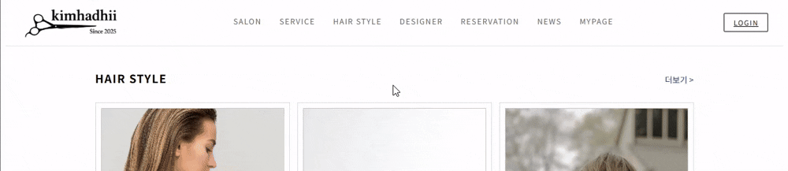
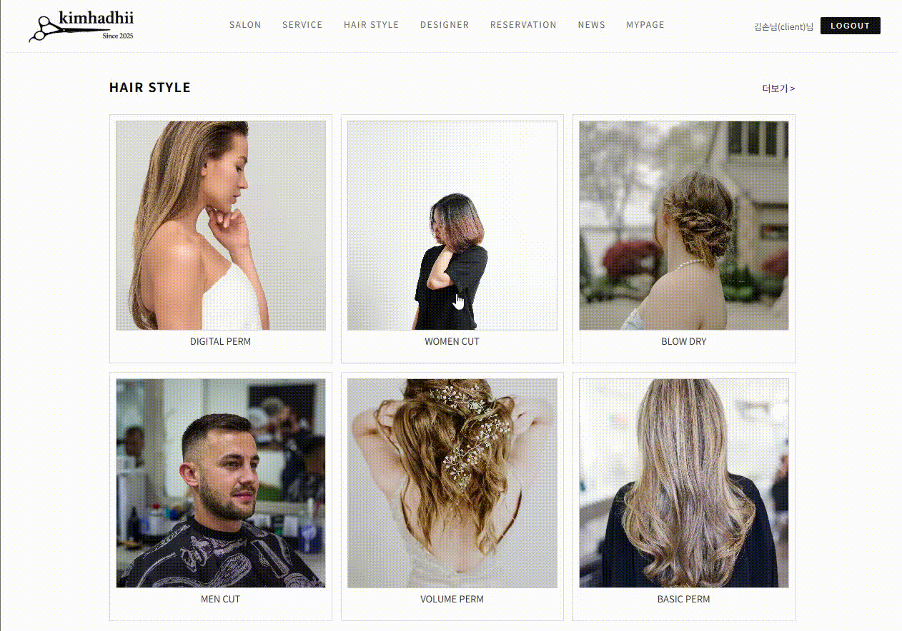
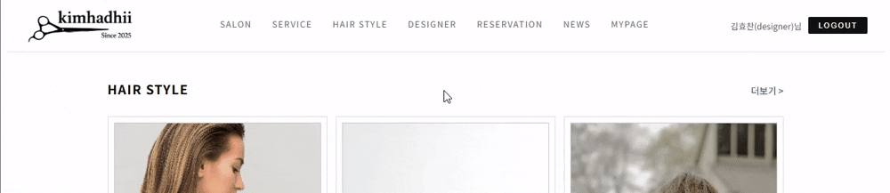

# 웹 기반 미용실 예약 관리 시스템 (Frontend)

> 웹 기반 미용실 예약 관리 시스템의 **프론트엔드(Vue.js) 구현을 담당한 결과물**을 면접 및 포트폴리오 목적에 맞게 정리한 리포지토리입니다.

---

## 목차
- [1. 프로젝트 소개](#프로젝트-소개)
- [2. 프로젝트 형태 및 역할](#프로젝트-형태-및-역할)
- [3. 주요 기능](#주요-기능)
- [4. 시스템 구성도](#시스템-구성)
- [5. 예약 화면 흐름 (Client)](#예약-화면-흐름-client)
- [6. 역할(Role) 기반 접근 제어](#역할role-기반-접근-제어)
- [7. 주요 화면](#주요-화면)
- [8. 관련 링크](#관련-링크)

---

## 프로젝트 소개

  

본 프로젝트는 **대학 내 미용실 예약 시스템의 부재**로 인해 발생하는 불편함을 해결하기 위해 기획된 **웹 기반 미용실 예약 관리 시스템**입니다.

본 리포지토리는 전체 시스템 중 **프론트엔드(Vue.js) 영역을 담당한 구현 내용과 설계를 중심으로 정리한 개인 포트폴리오용 리포지토리**입니다.

> ※ 실제 구현 코드는 학교 조직 리포지토리에 있으며, 본인은 팀 프로젝트에서 **프론트엔드 구현을 전담**했습니다.

-> 학교 조직 리포지토리: https://github.com/gsc-lab/cs25-3-frontend

---

## 프로젝트 형태 및 역할

- 프로젝트 형태: 팀 프로젝트
- 담당 역할: **프론트엔드 개발**

  - 화면 설계 및 UI 구현
  - 상태 관리 구조 설계
  - REST API 연동
  - 역할(Role) 기반 화면 접근 제어
  - 프론트엔드 오류 처리 흐름 설계

---

## 주요 기능

### Client
- 디자이너 · 날짜 · 시간 · 시술 선택 기반 예약 화면
- 예약 상태 확인 (진행 / 완료 / 취소)
- 마이페이지에서 예약 내역 조회 및 취소
- 예약 취소 시 사유 입력 UI

### Designer
- 본인 예약 내역 확인 화면
- 예약 상태 변경 UI

### Manager
- 디자이너 휴무 관리 UI
- 서비스(시술) 정보 관리 화면

---

## 시스템 구성도

  

본 시스템은 Vue.js로 빌드된 정적 파일을 Nginx에서 제공하고, 클라이언트 요청은 REST API를 통해 PHP-FPM과 MySQL로 처리되는 구조로 구성되어 있습니다.

---

## 예약 화면 흐름 (Client)

  

**예약 진행 흐름**  
디자이너 선택 → 날짜 선택 → 시간 선택 → 서비스 선택 → 요청사항 작성 → 예약 생성 → 마이페이지 이동

예약 화면에서는 **디자이너 예약 일정**, **휴무 정보(TimeOff)**를 함께 제공하여, 사용자가 **예약 불가 시간을 사전에 회피**할 수 있도록 UX를 설계했습니다.

---

## 역할(Role) 기반 접근 제어

| 사용자 유형 | 예약 페이지 접근 | 마이페이지 |
|------------|----------------|------------|
| Guest | ❌ | ❌ |
| Client | ✅ | Client 전용 |
| Designer | ❌ | Designer 전용 |
| Manager | ❌ | Manager 전용 |

- Pinia에 로그인 상태 및 사용자 역할 저장
- 역할에 따라 라우팅 및 화면 분기 처리

### Guest

  

### Client

  

### Designer

  

### Manager

  

---

## 주요 화면

> 실제 구현 화면 캡처 이미지입니다.

### 메인 페이지

  

### 예약 페이지

  

### 마이페이지 (Client)

  

### 마이페이지 (Designer)

  

### 마이페이지 (Manager)

  

---

## 🔗 관련 링크

- 개인 GitHub: https://github.com/HyoChan1117  
- 학교 조직 프로젝트 리포지토리: https://github.com/gsc-lab/cs25-3-frontend
