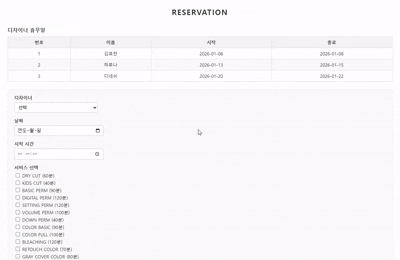

# 웹 기반 미용실 예약 관리 시스템 (Frontend)

> 웹 기반 미용실 예약 관리 시스템의 **프론트엔드(Vue.js) 구현을 담당한 결과물**을  
> 면접 및 포트폴리오 목적에 맞게 정리한 리포지토리입니다.

---

## 목차
- [프로젝트 소개](#프로젝트-소개)
- [프로젝트 형태 및 역할](#프로젝트-형태-및-역할)
- [주요 기능](#주요-기능)
  - [Client](#client)
  - [Designer](#designer)
  - [Manager](#manager)
- [기술 스택](#기술-스택)
- [시스템 구성도](#시스템-구성)
- [프론트엔드 구조 개요](#프론트엔드-구조-개요)
- [예약 화면 흐름 (UX 관점)](#예약-화면-흐름-ux-관점)
- [역할(Role) 기반 접근 제어](#역할role-기반-접근-제어)
- [문제 해결 경험](#문제-해결-경험)
- [주요 화면](#주요-화면)
- [프로젝트를 통해 얻은 점](#프로젝트를-통해-얻은-점)
- [개발자로서의 지향점](#개발자로서의-지향점)
- [관련 링크](#관련-링크)

---

## 프로젝트 소개
본 프로젝트는 **대학 내 미용실 예약 시스템의 부재**로 인해 발생하는 불편함을 해결하기 위해 기획된 **웹 기반 미용실 예약 관리 시스템**입니다.

본 리포지토리는 전체 시스템 중  
**프론트엔드(Vue.js) 영역을 담당한 구현 내용과 설계를 중심으로 정리한 개인 포트폴리오용 리포지토리**입니다.

> ※ 실제 구현 코드는 학교 조직 리포지토리에 있으며, 본인은 팀 프로젝트에서 **프론트엔드 구현을 전담**했습니다.
> 학교 조직 리포지토리: https://github.com/gsc-lab/cs25-3-frontend

---

## 프로젝트 형태 및 역할

- 프로젝트 형태: 팀 프로젝트
- 담당 역할: **프론트엔드 개발**
  - 화면 설계 및 UI 구현
  - 상태 관리 구조 설계
  - REST API 연동
  - 역할(Role) 기반 화면 접근 제어
  - 프론트엔드 오류 처리 흐름 설계

---

## 주요 기능 (Frontend 기준)

### Client
- 디자이너 · 날짜 · 시간 · 시술 선택 기반 예약 화면
- 예약 상태 확인 (진행 / 완료 / 취소)
- 마이페이지에서 예약 내역 조회 및 취소
- 예약 취소 시 사유 입력 UI

### Designer
- 본인 예약 내역 확인 화면
- 예약 상태 변경 UI

### Manager
- 디자이너 휴무 관리 UI
- 서비스(시술) 정보 관리 화면

---

## 기술 스택 (Frontend)

- **Vue.js**
- JavaScript
- Pinia (State Management)
- Axios (REST API 통신)

---

## 시스템 구성도

본 시스템은 Vue.js로 빌드된 정적 파일을 Nginx에서 제공하고, 클라이언트 요청은 REST API를 통해 PHP-FPM과 MySQL로 처리되는 구조로 구성되어 있습니다.

---

## 프론트엔드 구조 개요

- 컴포넌트 기반 화면 구성
- Pinia를 활용한 전역 상태 관리
- 사용자 Role(Client / Designer / Manager)에 따른
  - 화면 접근 제어
  - 라우팅 분기 처리
- REST API 기반 데이터 흐름 구성

---

## 예약 화면 흐름 (Client)

1. 디자이너 선택
2. 날짜 선택
3. 시간 선택
4. 서비스 선택
5. 요청사항 작성
6. 예약 생성 후 마이페이지 이동

예약 화면에서는  
- 디자이너의 **기존 예약 일정**
- **휴무 정보(TimeOff)**  

를 함께 제공하여, 사용자가 **예약 불가 시간을 사전에 회피**할 수 있도록 UX를 설계했습니다.

---

## 역할(Role) 기반 접근 제어

| 사용자 유형 | 예약 페이지 접근 | 마이페이지 |
|------------|----------------|------------|
| Guest | ❌ | ❌ |
| Client | ✅ | Client 전용 |
| Designer | ❌ | Designer 전용 |
| Manager | ❌ | Manager 전용 |

- Pinia에 로그인 상태 및 사용자 역할 저장
- 역할에 따라 라우팅 및 화면 분기 처리

---

## 문제 해결 경험 (Frontend 관점)

### 문제
백엔드 API 호출 과정에서  
모든 오류가 동일한 응답 형태로 전달되어  
프론트엔드에서 **정확한 오류 원인 파악이 어려웠습니다.**

### 해결
- 백엔드와 협의하여 **에러 코드 + 메시지 규칙 표준화**
- HTTP Status Code + Custom Error Code 기반 처리
- 프론트엔드에서는 에러 코드를 기준으로
  - 사용자 메시지 분기
  - 디버깅 포인트 명확화

### 결과
- 오류 원인 파악 시간 단축
- 프론트엔드–백엔드 간 공통 규칙 정립
- 유지보수 효율 향상

---

## 주요 화면 (Screenshots)

> 실제 구현 화면 캡처 이미지입니다.

### 메인 페이지

### 예약 페이지

### 마이페이지 (Client)

### 마이페이지 (Designer)

### 마이페이지 (Manager)

---

## 프로젝트를 통해 얻은 점

- 컴포넌트 단위로 화면을 설계하고 관리하는 경험
- 상태 관리(Pinia)를 통한 화면 간 데이터 동기화 이해
- REST API 기반 프론트엔드 데이터 흐름 체득
- 역할(Role)에 따른 화면 제어 설계 경험
- 오류를 단순히 처리하는 것이 아닌  
  **구조적으로 이해하고 개선하는 접근 방식** 학습

---

## 개발자로서의 지향점

- 문제를 즉시 수정하기보다 **원인을 먼저 분석하는 개발자**
- 기능 구현을 넘어서 **흐름과 구조를 이해하는 프론트엔드 엔지니어**
- 백엔드와의 경계를 이해하고 협업할 수 있는 개발자

---

## 🔗 관련 링크

- 개인 GitHub: https://github.com/HyoChan1117  
- 학교 조직 프로젝트 리포지토리: https://github.com/gsc-lab/cs25-3-frontend
